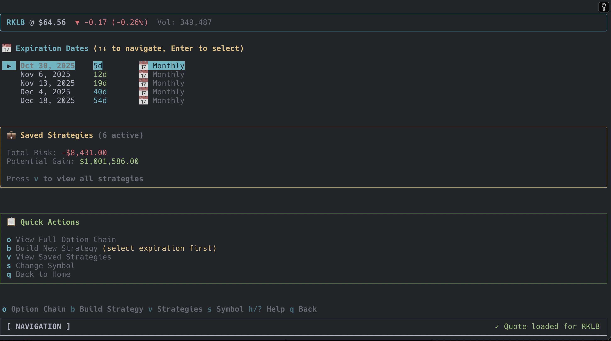
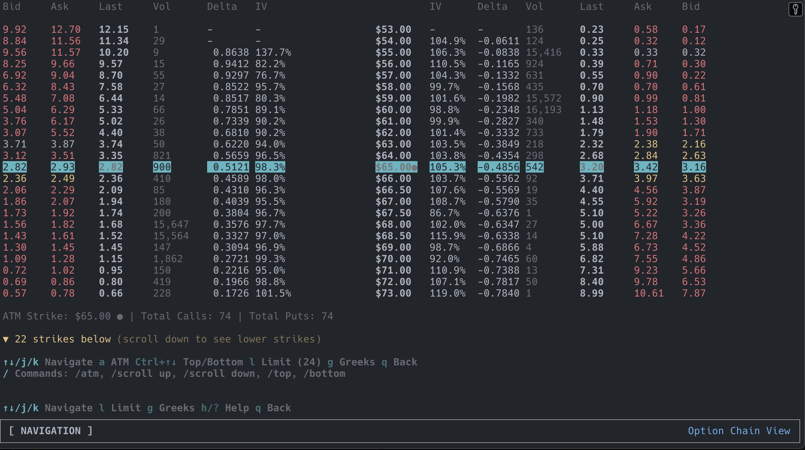
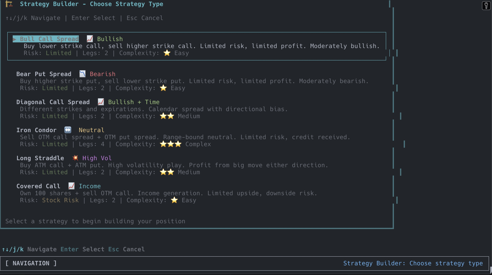

# Jesse Option Viewer TUI

A terminal-based user interface (TUI) application for viewing option chains and building option strategies using the Alpaca Markets API.

NOTE: An experiment in vibe coding with Claude Code

## Features

- 📊 View real-time stock quotes with price changes
- 📈 Display option chains with Greeks (delta, gamma, theta, vega, rho)
- 🏗️ Build option strategies with interactive wizard
  - Bull Call Spread
  - Bear Put Spread
  - Diagonal Call Spread (dual-expiration support)
  - Iron Condor
  - Long Straddle
  - Covered Call
- 💾 Save and manage option strategies with persistence
- ⌨️ Keyboard-driven navigation with vim-style shortcuts
- 🎨 Beautiful terminal UI with Ink and React
- 🧪 Comprehensive test suite (101 tests)

## Prerequisites

- Node.js >= 18.0.0
- Alpaca Markets account (Paper Trading supported)

## Setup

### 1. Install Dependencies

```bash
npm install
```

### 2. Configure API Keys

Create a `.env` file in the project root:

```bash
cp .env.example .env
```

Edit `.env` and add your Alpaca API credentials:

```env
ALPACA_API_KEY=your_paper_api_key_here
ALPACA_API_SECRET=your_paper_api_secret_here
ALPACA_PAPER=true
```

Get your API keys from [Alpaca Markets Dashboard](https://app.alpaca.markets/paper/dashboard/overview).

### 3. Run the Application

See the [Usage](#usage) section below for instructions on running the app.

## Project Structure

```
jesse-option-viewer-tui/
├── src/
│   ├── components/          # React/Ink UI components
│   │   ├── ExpirationSelect.tsx   # Expiration date selector
│   │   ├── Header.tsx             # App header
│   │   ├── OptionChain.tsx        # Option chain table display
│   │   ├── SavedStrategies.tsx    # Saved strategies list
│   │   ├── StatusBar.tsx          # Status bar with mode indicator
│   │   ├── StrategyBuilder.tsx    # Interactive strategy wizard
│   │   └── StrategySelector.tsx   # Strategy type selection
│   ├── screens/             # Screen components
│   │   ├── HelpScreen.tsx         # Help/keyboard shortcuts
│   │   ├── HomeScreen.tsx         # Welcome screen
│   │   └── OptionChainScreen.tsx  # Main option chain view
│   ├── context/             # React Context state management
│   │   └── AppContext.tsx         # Global state + reducer
│   ├── lib/                 # API wrappers and integrations
│   │   └── alpaca.ts              # Alpaca API client
│   ├── utils/               # Utility functions
│   │   ├── fetch.ts               # Rate-limited fetch + parsing
│   │   ├── formatters.ts          # Number/currency formatting
│   │   ├── logger.ts              # Emoji-enhanced logging
│   │   ├── storage.ts             # JSON file persistence
│   │   └── strategies.ts          # Strategy calculations
│   ├── types/               # TypeScript type definitions
│   │   └── index.ts
│   ├── App.tsx              # Main app + global input handler
│   └── index.tsx            # Entry point
├── tests/                   # Test suite (Vitest)
│   ├── fetch.test.ts              # API parsing tests
│   ├── strategies.test.ts         # Strategy calculation tests
│   └── test-utils/
│       └── mocks.ts               # Test mock factories
├── doc/                     # Documentation
│   └── global-input-handler-guidelines.md
├── logs/                    # Application logs (gitignored)
├── .env                     # API credentials (gitignored)
├── .env.example             # Example environment config
├── package.json
├── tsconfig.json
├── vitest.config.ts
└── README.md
```

## Usage

### Running the Application

**Development mode** (recommended for testing):
```bash
npm run dev
```

**Production mode**:
```bash
npm run build
npm start
```

### Quick Start

1. Run `npm run dev`
2. Press `s` to enter a stock symbol (e.g., "AAPL")
3. Navigate through expiration dates and view option chain
4. Press `b` to open strategy builder
5. Select a strategy type and follow the wizard

## Keyboard Shortcuts

### Home Screen
- `s` - Enter stock symbol
- `h` or `?` - Show help
- `q` - Quit application
- `Ctrl+C` - Exit

### Option Chain Screen
- `↑/↓` or `j/k` - Navigate up/down (vim-style)
- `e` - Focus expiration selector
- `o` - Focus option chain
- `l` - Toggle display limit (10/20/40/ALL)
- `g` - Toggle Greeks display
- `b` - Open strategy builder
- `s` - Change symbol
- `q` - Go back to home

### Strategy Builder
- `↑/↓` or `j/k` - Navigate options
- `Enter` - Select option/confirm
- `ESC` or `q` - Cancel builder
- `x` or `d` - Undo last leg selection
- `1/2/3/4` - Jump to specific leg (multi-leg strategies)
- `y` - Confirm save strategy

### Input Mode
- Type text and press `Enter` to submit
- `ESC` - Cancel input
- `Backspace` - Delete last character

## Architecture

### State Management
- Uses React Context + useReducer (not Redux)
- Centralized state in `AppContext`
- Follows global input handler pattern (see `doc/global-input-handler-guidelines.md`)

### API Integration
- Direct Alpaca API calls via wrapper methods in `lib/alpaca.ts`
- Secure credential handling via environment variables
- Mock data support for development

### Data Persistence
- Strategies saved to JSON file in `~/.option-viewer/strategies.json`
- Automatic directory creation
- Error handling for file operations

## Development

### Type Checking
```bash
npm run type-check
```

### Linting
```bash
npm run lint
```

### Testing
```bash
npm test
```

Watch mode:
```bash
npm run test:watch
```

## Implementation Status

### ✅ Completed
- [x] TypeScript project setup with strict type checking
- [x] Dependencies installed and configured (React, Ink, Vitest)
- [x] Alpaca API wrapper with v1beta1 and v2 endpoint support
- [x] Project folder structure with screens, components, context
- [x] Global input handler pattern implementation
- [x] State management with React Context + useReducer
- [x] Emoji-enhanced logging system with file output
- [x] JSON file persistence for strategies (~/.option-viewer/)
- [x] Stock quote display with real-time price changes
- [x] Option chain display with Greeks
- [x] Expiration date selection with days-to-expiry calculation
- [x] Strategy builder wizard with interactive selection
- [x] 6 option strategies implemented:
  - Bull Call Spread
  - Bear Put Spread
  - Diagonal Call Spread (dual-expiration)
  - Iron Condor (4-leg)
  - Long Straddle
  - Covered Call
- [x] Strategy metrics calculation (P&L, risk/reward, breakeven)
- [x] Saved strategies display with remove functionality
- [x] Comprehensive test suite (101 tests)
- [x] Type-safe API parsing with defensive validation

### 📋 Future Enhancements
- [ ] Additional strategies (Butterfly, Calendar, etc.)
- [ ] Strategy comparison view
- [ ] Real-time price updates with WebSocket
- [ ] Portfolio tracking
- [ ] Historical P&L charts

## Logging

The application uses emoji-enhanced logging for better debugging:
- 🔍 Debug messages
- ℹ️ Info messages
- ✅ Success messages
- ⚠️ Warnings
- ❌ Errors
- 🌐 API calls
- 💾 Data operations

## Security

- API keys stored in environment variables (never in code)
- `.env` file excluded from git
- Paper trading mode for safe testing

## License

MIT

## Contributing

See `CLAUDE.md` for development guidelines and conventions.

---

## Screenshots

### Symbol Entry Screen


### Option Chain View


### Strategy Builder

